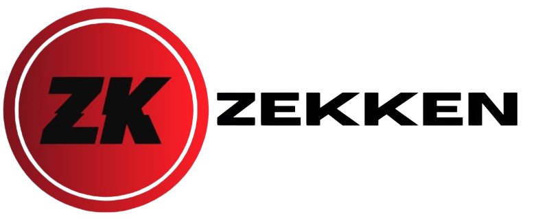

  <picture>
    
  </picture>

Zekken is a general-purpose language created purely with the Rust programming language, meant to be easy to learn and understand!

## Documentation
There isn't much documentation that I can resourcefully give as the language is still in early developement stages and hasn't fully matured and/or been tested 100%.