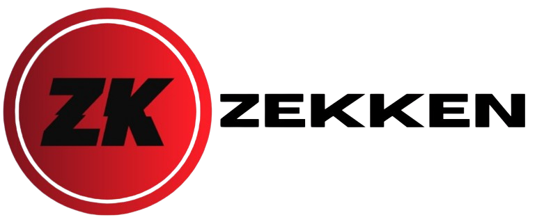

<div align="center">
  <picture>
    
  </picture>

[Website] | [Documentation] | [Demo] | [Download]
</div>

---

[Website]: https://ozrageharm.github.io/Zekken/
[Documentation]: https://ozrageharm.github.io/Zekken/website/Docs/getting-started.html
[Demo]: https://ozrageharm.github.io/Zekken/website/Demo/demo.html
[Download]: https://ozrageharm.github.io/Zekken/website/Download/download.html

***Zekken ("ZEH-ken") is a general-purpose language created purely with the Rust programming language, meant to be easy to learn and understand!***

## Why Zekken?
- **Performance**: Zekken, built on Rust, provides high-speed execution and efficient resource management, making it ideal for both small scripts and large applications.
- **Ease of Learning**: With a clean and intuitive syntax, Zekken allows beginners to quickly grasp programming concepts while enabling experienced developers to write clear, maintainable code.
- **Safety**: Utilizing Rust's strong memory safety features, Zekken minimizes common programming errors, ensuring robust and reliable applications.

## Status
Zekken is under active development and the language/standard library may change. If you hit a crash or confusing error, please open an issue with a minimal repro.

## Language Snapshot
```zekken
use math;

func hypotenuse |a: float, b: float| -> float {
  return math.sqrt => |a * a + b * b|;
}

let x: float = 3.0;
let y: float = 4.0;
let h: float = hypotenuse => |x, y|;
@println => |"hypotenuse: " + h|
```

## Development Logs ⚙
Stay informed about the latest changes, improvements, and fixes to Zekken. Below is a summary of the development progress:

### Early Development Log (Feb 2025 - Feb 14, 2026)
- **[View Full Development Log](./dev-logs/early-development.md)**

### Release Development Log (Feb 14, 2026 - Present)
- **[View Full Development Log](./dev-logs/release-development.md)**

## Documentation 📖
### Website Docs
- **[Getting Started](https://ozrageharm.github.io/Zekken/website/Docs/getting-started.html)**
- **[Syntax Basics](https://ozrageharm.github.io/Zekken/website/Docs/syntax-basics.html)**
- **[Types](https://ozrageharm.github.io/Zekken/website/Docs/types.html)**
- **[Functions](https://ozrageharm.github.io/Zekken/website/Docs/functions.html)**
- **[Libraries](https://ozrageharm.github.io/Zekken/website/Docs/libraries.html)**
- **[Errors](https://ozrageharm.github.io/Zekken/website/Docs/errors.html)**
- **[Examples](https://ozrageharm.github.io/Zekken/website/Docs/examples.html)**
- **[Roadmap](https://ozrageharm.github.io/Zekken/website/Docs/roadmap.html)**

## CLI Reference (Current)
- `zekken run [--vm] <file> [-- <script args...>]`
- `zekken repl`
- `zekken debug tokens <file>`
- `zekken debug ast <file>`

### Execution Modes
- Default: `zekken run file.zk` uses the evaluator in `src/eval`.
- Optional: `zekken run --vm file.zk` uses the register bytecode VM in `src/bytecode`.

## Quick Start
### Prerequisites
- Rust toolchain (`rustc`, `cargo`) installed
- Git installed
- For building the website demo (WASM): `wasm-pack` (recommended) or `wasm-bindgen-cli`

```bash
# Get source
git clone https://github.com/OzRAGEHarm/Zekken.git
cd Zekken

# Build CLI + WASM assets (host platform)
./scripts/build.sh all

# Build CLI for both Linux + Windows targets too (requires cross toolchains)
./scripts/build.sh cli all

# Run a file
./target/release/zekken run main.zk

# Run using the bytecode VM
./target/release/zekken run --vm main.zk

# Debug: print lexer tokens or AST
./target/release/zekken debug tokens main.zk
./target/release/zekken debug ast main.zk

# Show CLI help
./target/release/zekken --help
```

Windows:
```bat
:: Get source
git clone https://github.com/OzRAGEHarm/Zekken.git
cd Zekken

:: Build CLI + WASM assets
.\scripts\build.bat both

:: Run a file
.\target\release\zekken run main.zk

:: Show CLI help
.\target\release\zekken --help
```

## Benchmarks
There is a small benchmark suite under [`benchmarks/`](./benchmarks) with a runner and Python comparisons.
See [`benchmarks/README.md`](./benchmarks/README.md).

## Repo Layout (High-Level)
- `src/lexer`, `src/parser`, `src/ast`: front-end
- `src/eval`: evaluator (default `zekken run`)
- `src/bytecode`: register bytecode VM (`zekken run --vm`)
- `src/libraries`: standard library modules
- `website/`: website + docs + demo (WASM build)

## License 🏛
This project is licensed under the MIT License - see the [LICENSE](./LICENSE) file for details.
